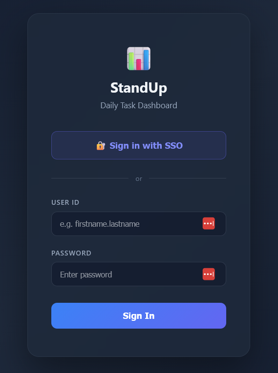
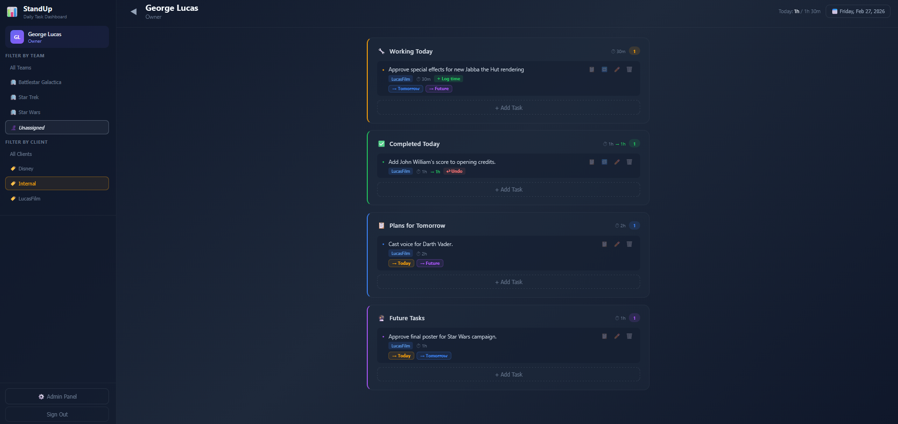
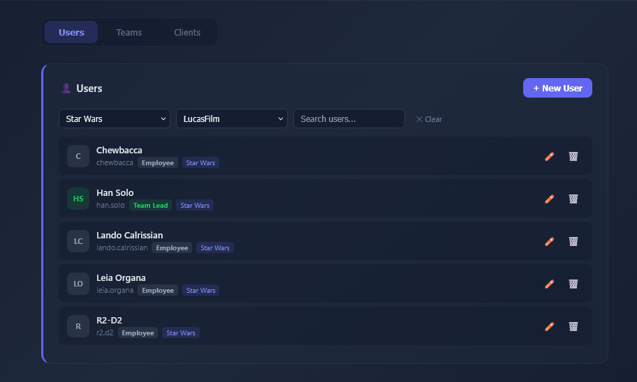
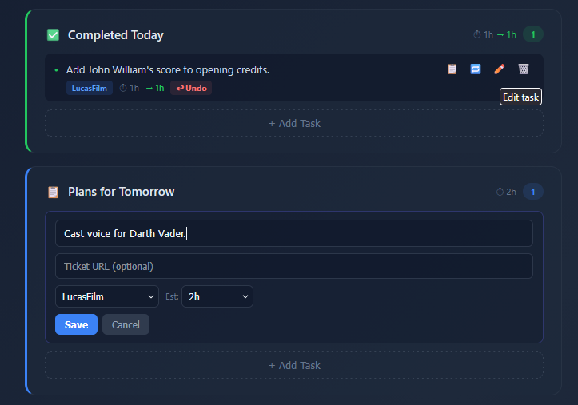
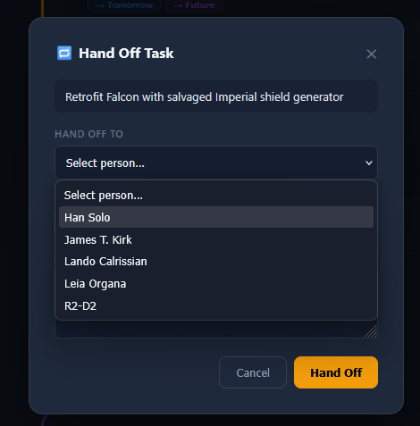
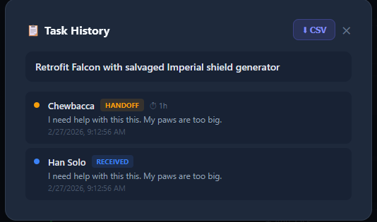

# StandUp - Daily Task Dashboard

A self-hosted team standup dashboard for tracking daily work across teams. Managers and team leads see what everyone is working on, completed, and planning for tomorrow — all in one view. Includes role-based permissions, time tracking, client assignment, and task handoffs between team members.

Built with React, Express, PostgreSQL, and Docker. Supports optional SSO via Keycloak SAML.

## Screenshots

| Login | Dashboard | Admin Panel |
|-------|-----------|-------------|
|  |  |  |

| Task Editing | Handoff Modal | Task History |
|--------------|---------------|--------------|
|  |  |  |

## Features

- **Daily task board** — Working Today, Completed, Tomorrow, and Future sections per team member
- **Calendar picker** — View any team member's tasks on any date
- **Role-based access** — Owners see everyone; managers see their teams; team leads see their members; employees see only themselves
- **Time tracking** — Estimate time per task, log actual time on completion
- **Client assignment** — Every task is tied to a client for reporting
- **Task handoffs** — Transfer tasks between team members with history tracking
- **Admin panel** — Manage users, teams, and clients from the UI
- **Pluggable authentication** — Local passwords, SAML/SSO (Keycloak), or both

## Architecture

```
┌─────────────┐     ┌──────────────┐     ┌──────────────┐
│   Frontend   │────>│   Backend    │────>│  PostgreSQL   │
│  React/Vite  │     │  Express API │     │              │
│  nginx :80   │     │    :3000     │     │   :5432      │
└─────────────┘     └──────────────┘     └──────────────┘
                           │
                    ┌──────┴───────┐
                    │  Keycloak    │  (optional)
                    │  SAML IdP    │
                    │   :8180      │
                    └──────────────┘
```

## Quick Start

### 1. Clone and configure

```bash
git clone https://github.com/your-org/standup.git
cd standup
cp .env.example .env
```

Edit `.env` and set secure values for `DB_PASSWORD` and `JWT_SECRET`.

### 2. Start with Docker Compose

```bash
docker compose up -d --build
```

### 3. Open the app

Navigate to `http://localhost:8880` in your browser.

### Demo logins

The seed data includes a sci-fi themed org. Owner accounts use `admin` as the password; everyone else uses `password`.

| User | ID | Password | Role |
|------|-----|----------|------|
| Gene Roddenberry | gene.roddenberry | admin | Owner |
| James T. Kirk | james.kirk | password | Manager |
| Spock | spock | password | Team Lead |
| Leonard McCoy | leonard.mccoy | password | Employee |

## Authentication

StandUp uses a **strategy pattern** for authentication. Providers are pluggable modules controlled by environment variables. The login page automatically adapts to show whichever methods are enabled.

### Option 1: Local passwords (default)

Works out of the box with no extra configuration. Users log in with a username and password stored in PostgreSQL (bcrypt-hashed).

### Option 2: SAML SSO with Keycloak

For organizations that use a central identity provider. StandUp ships with a Keycloak container and pre-configured SAML realm.

**Setup:**

1. Copy the example realm configuration:

```bash
cp keycloak/standup-realm.example.json keycloak/standup-realm.json
```

For production, edit `standup-realm.json` and replace `http://localhost:8880` with your public URL in `redirectUris`, `baseUrl`, `adminUrl`, and `saml_assertion_consumer_url_post`.

2. Uncomment the SAML variables in `.env`:

```bash
SAML_ENTRYPOINT=http://localhost:8180/auth/realms/standup/protocol/saml
SAML_ISSUER=standup
SAML_CALLBACK_URL=http://localhost:8880/api/auth/saml/acs
SAML_CERT=<keycloak signing cert>
```

3. Start with the SSO profile:

```bash
docker compose --profile sso up -d --build
```

4. Get the Keycloak signing certificate:
   - Open the Keycloak admin console at `http://localhost:8180/auth/` (admin/admin)
   - Go to **Realm Settings > Keys > RS256** and copy the certificate
   - Paste it into `SAML_CERT` in your `.env` (base64 string, no PEM headers)

5. Rebuild the backend to pick up the cert:

```bash
docker compose up -d --build backend
```

The login page will now show a **"Sign in with SSO"** button above the local login form. Users who authenticate via SSO are automatically provisioned in the database.

> **Note:** The realm is re-imported on every Keycloak restart, which regenerates signing keys. If you restart Keycloak, you'll need to grab the new certificate and rebuild the backend.

### Option 3: SSO only (no local passwords)

To hide the local login form entirely:

```bash
AUTH_LOCAL_DISABLED=true
```

### Adding your own auth provider

Auth providers live in `backend/src/auth-providers/`. Each is a module exporting:

```javascript
module.exports = {
  name: 'my-provider',         // Shown in GET /api/auth/providers
  isEnabled() { ... },          // Check env vars
  getRoutes(app) { ... },       // Mount Express routes
};
```

Register it in `backend/src/auth-providers/index.js` and it will be auto-discovered.

## SAML Environment Variables

| Variable | Required | Default | Description |
|----------|----------|---------|-------------|
| `SAML_ENTRYPOINT` | Yes | — | Keycloak SAML SSO URL |
| `SAML_ISSUER` | Yes | — | SAML Service Provider entity ID |
| `SAML_CALLBACK_URL` | No | `http://localhost:8880/api/auth/saml/acs` | Assertion Consumer Service URL |
| `SAML_CERT` | Yes | — | Keycloak signing cert (base64, no PEM headers) |
| `SAML_DEFAULT_ROLE` | No | `employee` | Role for auto-provisioned SSO users |
| `FRONTEND_URL` | No | `/` | Where to redirect after SSO login (set to your public URL in production) |
| `AUTH_LOCAL_DISABLED` | No | `false` | Set `true` to hide local login |
| `KEYCLOAK_ADMIN_PASSWORD` | No | `admin` | Keycloak admin console password |

## Role Hierarchy

```
Owner
  └── Can see/edit everyone, manage all users/teams/clients

Manager
  └── Can see/edit their teams, manage team members

Team Lead
  └── Can see/edit their team members (lower roles only)

Employee
  └── Can only see/edit their own tasks
```

## Maintenance

```bash
# View logs
docker compose logs -f backend

# Reset database (destroys all data)
docker compose down -v
docker compose up -d --build

# Backup database
docker exec standup-db pg_dump -U standup standup > backup.sql

# Restore database
cat backup.sql | docker exec -i standup-db psql -U standup standup
```

## API Endpoints

| Method | Endpoint | Auth | Description |
|--------|----------|------|-------------|
| `GET` | `/api/auth/providers` | No | List enabled auth methods |
| `POST` | `/api/auth/login` | No | Local login, returns JWT |
| `GET` | `/api/auth/me` | JWT | Current user info |
| `GET` | `/api/auth/saml/login` | No | Initiate SAML redirect |
| `POST` | `/api/auth/saml/acs` | No | SAML assertion callback |
| `GET` | `/api/auth/saml/metadata` | No | SP metadata XML |
| `GET` | `/api/users` | JWT | List visible users |
| `POST` | `/api/users` | JWT | Create user (admin) |
| `PUT` | `/api/users/:id` | JWT | Update user |
| `DELETE` | `/api/users/:id` | JWT | Delete user (admin) |
| `GET` | `/api/teams` | JWT | List teams |
| `POST` | `/api/teams` | JWT | Create team (admin) |
| `PUT` | `/api/teams/:id` | JWT | Update team (admin) |
| `DELETE` | `/api/teams/:id` | JWT | Delete team (admin) |
| `GET` | `/api/clients` | JWT | List clients |
| `POST` | `/api/clients` | JWT | Create client (admin) |
| `GET` | `/api/tasks/:userId` | JWT | Get user's tasks |
| `POST` | `/api/tasks` | JWT | Create task |
| `PUT` | `/api/tasks/:id` | JWT | Update task |
| `DELETE` | `/api/tasks/:id` | JWT | Delete task |
| `POST` | `/api/tasks/:id/handoff` | JWT | Transfer task to another user |
| `GET` | `/api/tasks/:id/history` | JWT | Task handoff history |

## Using the App

### Dashboard Layout

After logging in you land on the main dashboard. The **left sidebar** shows team members grouped by team, with badge counts for each task section. The **main area** shows four task sections for the selected user:

- **Working Today** — tasks actively being worked on
- **Completed Today** — tasks with logged time (done for the day)
- **Plans for Tomorrow** — queued for the next day
- **Future Tasks** — backlog items for later

### Navigating Dates

Click the **date display** in the top-right header to open the calendar picker. Select any date to view that day's tasks. The sidebar badge counts update to reflect the selected date. Click **"Today"** to jump back to the current date.

### Creating Tasks

1. Click **"+ Add Task"** at the bottom of any section
2. Type a task description
3. Select a **client** (required)
4. Optionally set an **estimated time** and a **ticket URL**
5. Click **Add** (or press Enter)

Tasks are created in whichever section you clicked the button in. The Add button stays dimmed until both a description and client are provided.

### Editing Tasks

Click the **pencil icon** on any task to expand the inline editor. You can change the description, client, estimated time, actual time, and ticket URL. Press Enter or click **Save** to confirm, Escape or **Cancel** to discard.

### Completing Tasks

In the Working Today section, click **"+ Log time"** on a task to mark it complete. This moves it to Completed Today with the estimated time pre-filled as actual. To adjust the actual time, edit the task and change it.

To undo a completion, click **"Undo"** on any completed task — it returns to Working Today.

### Moving Tasks Between Sections

Each task in Working Today shows **move buttons** to shift it to Tomorrow or Future. Similarly, Tomorrow and Future tasks have buttons to move them to other sections. Move buttons are hidden on completed tasks and when viewing past dates.

### Task Handoffs

To transfer a task to a teammate:

1. Hover over the task to reveal the action icons on the right
2. Click the **handoff icon** (circular arrows)
3. Select the person to hand off to
4. Log the time you spent on it
5. Optionally add a handoff note
6. Click **Hand Off**

The task moves to the recipient's Working Today. Handoff history is preserved.

### Viewing Task History

Click the **clipboard icon** on any task to see its full history — who created it, every handoff with timestamps, time logged at each step, and notes. This modal also has a **"CSV" button** to download the history as a spreadsheet.

### Admin Panel (Owners and Managers)

Click the **gear icon** in the top-right to open the admin panel. It has three tabs:

- **Users** — Create, edit, or delete users. Set their name, role, password, and team memberships. When creating a user, the ID auto-generates from their name.
- **Teams** — Create and manage teams. Assign a manager and team lead to each.
- **Clients** — Create and manage clients that tasks are assigned to.

### Viewing Other Team Members

The sidebar lists all team members you have permission to see. Click any name to view their tasks. If you have edit permission (based on role hierarchy), you can add, edit, move, and complete tasks on their behalf.

Team leads with multiple teams see a **team filter** dropdown to switch between teams.

## Roadmap

- **Google SAML SSO** — Add Google Workspace as a SAML identity provider option alongside Keycloak
- Additional third-party auth provider integrations

## License

MIT
